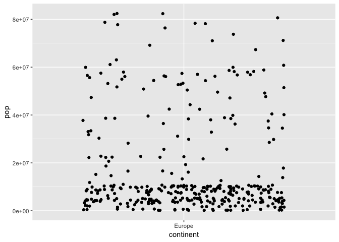

Homework assignment 2
================

This assignment is about exploring the $ data set, using built in functions to extract information and generate plots.

    ## -- Attaching packages -------------------------------------------------------- tidyverse 1.2.1 --

    ## <U+221A> ggplot2 3.0.0     <U+221A> purrr   0.2.4
    ## <U+221A> tibble  1.4.2     <U+221A> dplyr   0.7.6
    ## <U+221A> tidyr   0.8.1     <U+221A> stringr 1.2.0
    ## <U+221A> readr   1.1.1     <U+221A> forcats 0.3.0

    ## Warning: package 'ggplot2' was built under R version 3.4.4

    ## Warning: package 'tidyr' was built under R version 3.4.4

    ## Warning: package 'dplyr' was built under R version 3.4.4

    ## -- Conflicts ----------------------------------------------------------- tidyverse_conflicts() --
    ## x dplyr::filter() masks stats::filter()
    ## x dplyr::lag()    masks stats::lag()

**Smell the test data**

-   The gapminder data set is a:

``` r
typeof(gapminder)
```

    ## [1] "list"

-   With class:

``` r
class(gapminder)
```

    ## [1] "tbl_df"     "tbl"        "data.frame"

-   Number of rows and columns:

``` r
nrow(gapminder)
```

    ## [1] 1704

``` r
ncol(gapminder)
```

    ## [1] 6

-   These facts could also be extracted using e.g.

``` r
?gapminder
```

which displays general information about the data set, or:

``` r
glimpse(gapminder)
```

    ## Observations: 1,704
    ## Variables: 6
    ## $ country   <fct> Afghanistan, Afghanistan, Afghanistan, Afghanistan, ...
    ## $ continent <fct> Asia, Asia, Asia, Asia, Asia, Asia, Asia, Asia, Asia...
    ## $ year      <int> 1952, 1957, 1962, 1967, 1972, 1977, 1982, 1987, 1992...
    ## $ lifeExp   <dbl> 28.801, 30.332, 31.997, 34.020, 36.088, 38.438, 39.8...
    ## $ pop       <int> 8425333, 9240934, 10267083, 11537966, 13079460, 1488...
    ## $ gdpPercap <dbl> 779.4453, 820.8530, 853.1007, 836.1971, 739.9811, 78...

``` r
#or
#summary(gapminder)
```

These functions are really nice to display general information about the data set.

-   Each variable is of datatype:

``` r
class(gapminder$country)
```

    ## [1] "factor"

``` r
class(gapminder$continent)
```

    ## [1] "factor"

``` r
class(gapminder$lifeExp)
```

    ## [1] "numeric"

``` r
class(gapminder$pop)
```

    ## [1] "integer"

``` r
class(gapminder$year)
```

    ## [1] "integer"

``` r
class(gapminder$gdpPercap)
```

    ## [1] "numeric"

``` r
#can also use lapply function, i.e. lapply(gapminder,class)
```

**Explore individual variables**

Looking further into the `pop`, `lifeExp`, and the `continent` variables.

-   population:

``` r
#showing highest and lowest values of variable:
range(gapminder$pop)
```

    ## [1]      60011 1318683096

``` r
#or
summary(gapminder$pop)
```

    ##      Min.   1st Qu.    Median      Mean   3rd Qu.      Max. 
    ## 6.001e+04 2.794e+06 7.024e+06 2.960e+07 1.959e+07 1.319e+09

This shows some basic facts about the data in the population column.

The distribution can be seen from the following histogram:

``` r
gapminder %>%  
  ggplot(aes(x = pop, y = ..density..)) + 
  geom_histogram(bins = 50) +
  geom_vline(xintercept = exp(mean(log(gapminder$pop)))) +
  scale_x_log10() +
  ggtitle("Histogram of the log population")
```


Added mean line to illustrate.

We can check wheter the distribution is normal by looking at the residuals in a qq-plot:

``` r
fit = lm(gapminder$lifeExp~gapminder$year)
ggplot(gapminder, aes(sample = resid(fit))) +
  stat_qq() +
  stat_qq_line()
```


We observe that the distribution residuals not really are on line, which may indicate that the distribution is not normal.

Would also be nice to see the most populated countries in, say, 1957. Below we see the top 3:

``` r
picked_year <- gapminder %>%  
  select(country, pop, year) %>% 
  filter(year == 1957) 
```

    ## Warning: package 'bindrcpp' was built under R version 3.4.4

``` r
max_year <- picked_year %>% 
  filter(pop >= sort(pop, decreasing=TRUE)[3])


max_year
```

    ## # A tibble: 3 x 3
    ##   country             pop  year
    ##   <fct>             <int> <int>
    ## 1 China         637408000  1957
    ## 2 India         409000000  1957
    ## 3 United States 171984000  1957

-   continent:

We can summarize the number of observations per continent:

``` r
table(gapminder$continent)
```

    ## 
    ##   Africa Americas     Asia   Europe  Oceania 
    ##      624      300      396      360       24

This shows that Africa has the largest number of observations with 624, while Oceania has the lowest with 24.

-   life expectancy

We can display the `lifeExp` distribution by making a density plot:

``` r
gapminder %>% 
  ggplot(aes(lifeExp)) +
  geom_density()
```


**Explore various plot types**

Some plots of the different variables:

-   a scatter plot between two quantitative variables, `population` and `continent`, focusing on Europe.

``` r
lifeExp = gapminder$lifeExp
year = gapminder$year
pop = gapminder$pop
continent = gapminder$continent

gapminder %>% 
  filter(continent == "Europe") %>% 
  ggplot(aes(continent, pop)) +
  geom_jitter() #+ scale_y_log10()
```



-   It would be interesting to see how the life expectancy varies with every continent. Let us plot the density showing the differences in life expectancy in the different continents:

``` r
gapminder %>%
  ggplot(aes(x = lifeExp, y = ..density..)) +
  geom_density(fill = 'blue', alpha = 0.5) +
  facet_grid(~continent)  +
  theme_bw() +
  ggtitle("Density plot of Life Expectancy")
```


-   Would also be interesting to see how life expectancy in Norway has changed throughout the years:

``` r
gapminder %>% 
  filter(country == 'Norway') %>% 
  ggplot(aes(year, lifeExp)) + 
  geom_line()
```


Interesting to see how the life expectancy has increased rapidly from the mid 80's and to today. Increased welfare programs, higher education, better jobs and a higher standard of living may be reasons for this.

Let us quickly investigate whether there is a connection between higher GDP and life expectancy:

``` r
gapminder %>% 
  filter(country == "Norway") %>% 
  ggplot(aes(log(gdpPercap), lifeExp)) +
  geom_line()
```


Looks like there is a certain connenction here.

Looking at a QQ-plot of a fitted model with and , we also see that there might be a connenction between the two.

``` r
fit = lm(gapminder$lifeExp~gapminder$gdpPercap)
summary(fit)
```

    ## 
    ## Call:
    ## lm(formula = gapminder$lifeExp ~ gapminder$gdpPercap)
    ## 
    ## Residuals:
    ##     Min      1Q  Median      3Q     Max 
    ## -82.754  -7.758   2.176   8.225  18.426 
    ## 
    ## Coefficients:
    ##                      Estimate Std. Error t value Pr(>|t|)    
    ## (Intercept)         5.396e+01  3.150e-01  171.29   <2e-16 ***
    ## gapminder$gdpPercap 7.649e-04  2.579e-05   29.66   <2e-16 ***
    ## ---
    ## Signif. codes:  0 '***' 0.001 '**' 0.01 '*' 0.05 '.' 0.1 ' ' 1
    ## 
    ## Residual standard error: 10.49 on 1702 degrees of freedom
    ## Multiple R-squared:  0.3407, Adjusted R-squared:  0.3403 
    ## F-statistic: 879.6 on 1 and 1702 DF,  p-value: < 2.2e-16

``` r
plot(fit, 2)
```


**But I want to do more!**

It seems like some of the data is missing. Instead of the provided code, we could try something like:

``` r
gapminder %>%
  filter(country == "Rwanda" | country == "Afghanistan") %>%
  knitr::kable()
```

| country        | continent    |     year|  lifeExp|       pop|  gdpPercap|
|:---------------|:-------------|--------:|--------:|---------:|----------:|
| Afghanistan    | Asia         |     1952|   28.801|   8425333|   779.4453|
| Afghanistan    | Asia         |     1957|   30.332|   9240934|   820.8530|
| Afghanistan    | Asia         |     1962|   31.997|  10267083|   853.1007|
| Afghanistan    | Asia         |     1967|   34.020|  11537966|   836.1971|
| Afghanistan    | Asia         |     1972|   36.088|  13079460|   739.9811|
| Afghanistan    | Asia         |     1977|   38.438|  14880372|   786.1134|
| Afghanistan    | Asia         |     1982|   39.854|  12881816|   978.0114|
| Afghanistan    | Asia         |     1987|   40.822|  13867957|   852.3959|
| Afghanistan    | Asia         |     1992|   41.674|  16317921|   649.3414|
| Afghanistan    | Asia         |     1997|   41.763|  22227415|   635.3414|
| Afghanistan    | Asia         |     2002|   42.129|  25268405|   726.7341|
| Afghanistan    | Asia         |     2007|   43.828|  31889923|   974.5803|
| Rwanda         | Africa       |     1952|   40.000|   2534927|   493.3239|
| Rwanda         | Africa       |     1957|   41.500|   2822082|   540.2894|
| Rwanda         | Africa       |     1962|   43.000|   3051242|   597.4731|
| Rwanda         | Africa       |     1967|   44.100|   3451079|   510.9637|
| Rwanda         | Africa       |     1972|   44.600|   3992121|   590.5807|
| Rwanda         | Africa       |     1977|   45.000|   4657072|   670.0806|
| Rwanda         | Africa       |     1982|   46.218|   5507565|   881.5706|
| Rwanda         | Africa       |     1987|   44.020|   6349365|   847.9912|
| Rwanda         | Africa       |     1992|   23.599|   7290203|   737.0686|
| Rwanda         | Africa       |     1997|   36.087|   7212583|   589.9445|
| Rwanda         | Africa       |     2002|   43.413|   7852401|   785.6538|
| Rwanda         | Africa       |     2007|   46.242|   8860588|   863.0885|
| Now we see tha | t the data i |  s resto|     red.|          |           |

**Conclusion**

I have looked further into the data set and investigated (lightly) how different varaibles affect each other.
